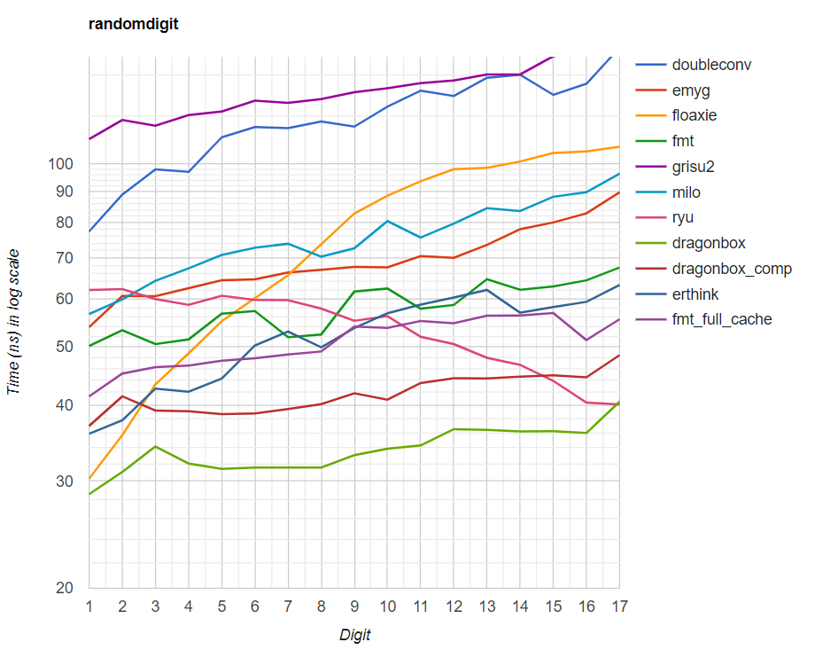
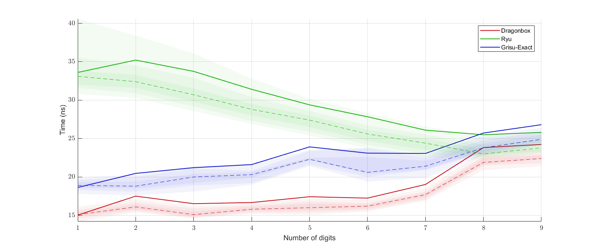
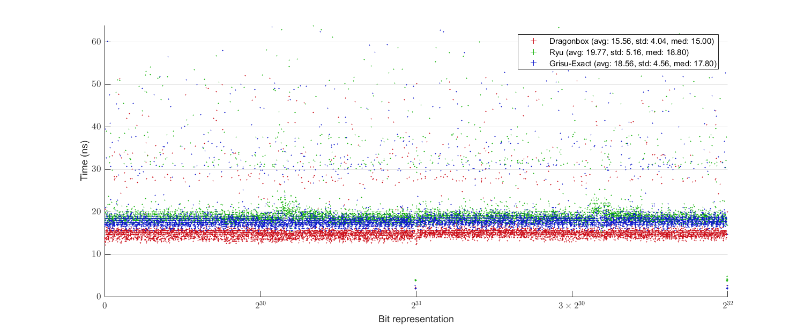
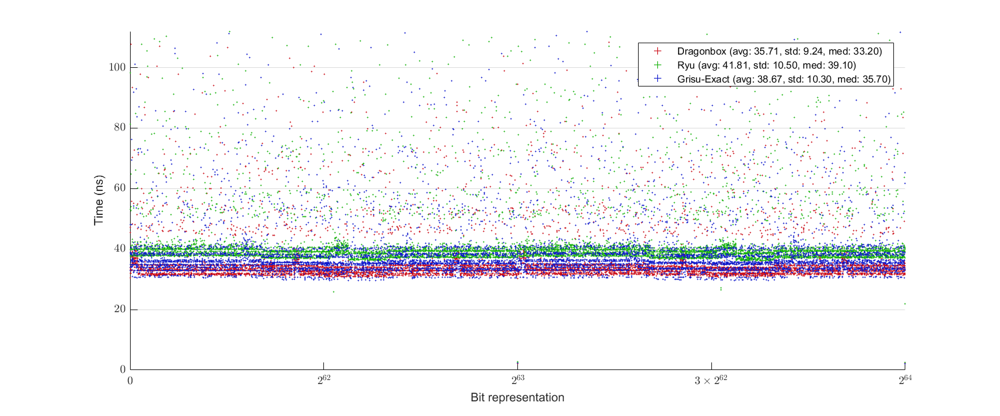
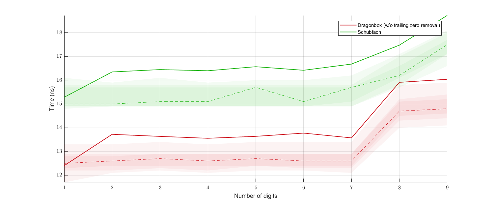
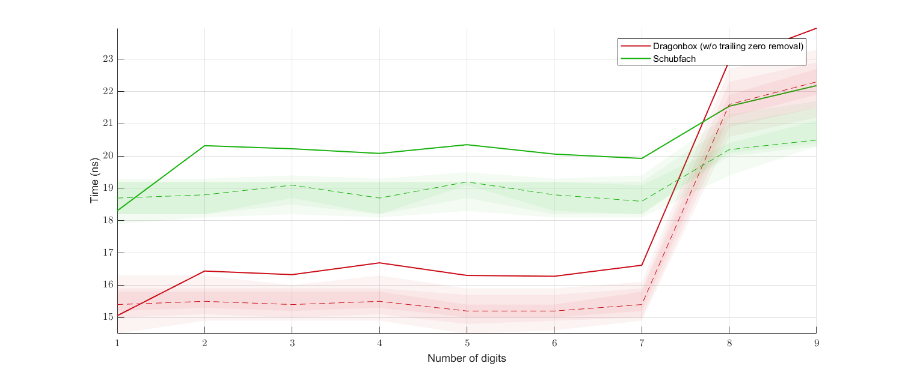
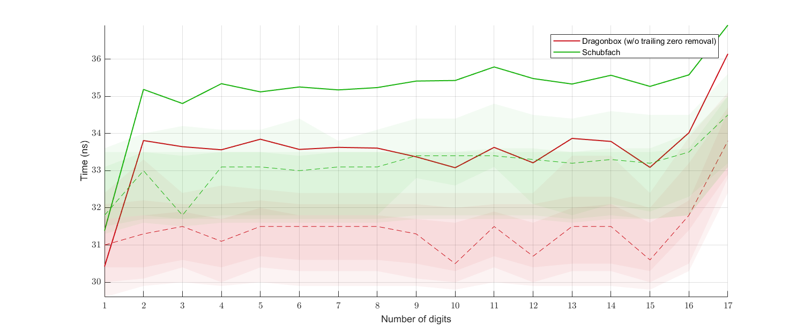

# Dragonbox
This library is a reference implementation of Dragonbox in C++.

Dragonbox is a float-to-string conversion algorithm based on a beautiful algorithm [Schubfach](https://drive.google.com/open?id=1luHhyQF9zKlM8yJ1nebU0OgVYhfC6CBN), developed by Raffaello Giulietti in 2017-2018. Dragonbox is further inspired by [Grisu](https://www.cs.tufts.edu/~nr/cs257/archive/florian-loitsch/printf.pdf) and [Grisu-Exact](https://github.com/jk-jeon/Grisu-Exact).

# Introduction
Dragonbox generates a pair of integers from a floating-point number: the decimal significand and the decimal exponent of the input floating-point number. These integers can then be used for string generation of decimal representation of the input floating-point number, the procedure commonly called ````ftoa```` or ````dtoa````.

The algorithm guarantees three things:

1) It has the roundtrip guarantee; that is, a correct parser interprets the generated output string as the original input floating-point number.

2) The output is of the shortest length; that is, no other output strings that are interpreted as the input number can contain less number of significand digits than the output of Dragonbox.

3) The output is correctly rounded: the number generated by Dragonbox is the closest to the actual value of the input number among possible outputs of minimum number of digits.

# About the Name "Dragonbox"
The core idea of Schubfach, which Dragonbox is based on, is a continuous analogue of discrete [pigeonhole principle](https://en.wikipedia.org/wiki/Pigeonhole_principle). German name of this principle is *Schubfachprinzip* (meaning "drawer principle"), thus the name *Schubfach*. Since the pigeonhole principle is sometimes also called *Dirichlet's box principle*, the name *Dragonbox* is honoring its origins: Schubfach (box) and Grisu (dragon).

# How to Use
Although Drgonbox is intended for float-to-string conversion routines, the actual string generation is not officially a part of the algorithm. Dragonbox just outputs two integers (the decimal significand/exponent) that can be consumed by a string generation procedure. The header file [`dragonbox.h`](dragonbox.h) includes everything needed for this. It is header-only; you just need these two steps for using it:

1) Drop [`dragonbox.h`](grisu_exact.h) in your include directory, and
2) `#include` it. That's it.

Nevertheless, a string generation procedure is included in the library. There are two additional files needed for that: [`dragonbox_to_chars.h`](dragonbox_to_chars.h) and [`dragonbox_to_chars.cpp`](dragonbox_to_chars/dragonbox_to_chars.cpp) (the `.cpp` file is in the directory [`dragonbox_to_chars`](dragonbox_to_chars)). If you want to use them too, then:

1) In addition to [`dragonbox.h`](dragonbox.h), drop [`dragonbox_to_chars.h`](dragonbox_to_chars.h) in your include directory,
2) `#include` [`dragonbox_to_chars.h`](dragonbox_to_chars.h) instead of [`dragonbox.h`](dragonbox.h),
3) Build [`dragonbox_to_chars.cpp`](dragonbox_to_chars/dragonbox_to_chars.cpp) as a library, and then
4) Link against it.

(Please be aware that [`dragonbox_to_chars.cpp`](dragonbox_to_chars/dragonbox_to_chars.cpp) is expecting to have [`dragonbox_to_chars.h`](dragonbox_to_chars.h) in the parent directory of itself.)

However, note that features provided in [`dragonbox_to_chars.h`](dragonbox_to_chars.h)/[`.cpp`](dragonbox_to_chars/dragonbox_to_chars.cpp) are quite limited and subject to change. Currently, there is no way to indicate any formatting options. Every float/double input is just printed as something like `-3.34E3`. No option for putting plus sign (+) in front of positive significands or positive exponents, no way to use `e` instead of `E`, no option for printing in a fixed-point form (like `-3340`), etc.. Also there is no way to precompute the minimum required size of buffer. I don't like this rigidity, and hope to add more customization features later. Yet, you can rather use `dragonbox.h` directly to implement your own string generation routine.

Besides these three, any other files are unncessary for real use.

A comprehensive reference for this library is in preparation.

# Language Standard
The library is targetting C++17 and actively using its features (e.g., `if constexpr`).

# Usage Examples
(Simple string generation from `float/double`)
```cpp
#include "dragonbox_to_chars.h"
double x = 1.234;  // Also works for float
char buffer[31];   // Should be long enough

// Null-terminate the buffer and return the pointer to the null character
// Hence, the length of the string is (end_ptr - buffer)
// buffer is now { '1', '.', '2', '3', '4', 'E', '0', '\0', (garbages) }
char* end_ptr = jkj::dragonbox::to_chars(x, buffer);

// Does not null-terminate the buffer; returns the next-to-end pointer
// buffer is now { '1', '.', '2', '3', '4', 'E', '0', (garbages) }
// you can wrap the buffer with things like std::string_view
end_ptr = jkj::dragonbox::to_chars_n(x, buffer);
```

(Direct use of `jkj::dragonbox::to_decimal`)
```cpp
#include "dragonbox.h"
double x = 1.234;   // Also works for float

// Here, x should be a nonzero finite number!
// The return value v is a struct with three members:
// significand : decimal significand (1234 in this case);
//               it is of type std::uint64_t for double, std::uint32_t for float
//    exponent : decimal exponent (-3 in this case); it is of type int
// is_negative : as the name suggests; it is of type bool
auto v = jkj::dragonbox::to_decimal(x);
```

By default, `jkj::dragonbox::to_decimal` returns a struct with three members (`significand`, `exponent`, and `is_negative`). But the return type and the return value can change if you specify first two template paramters.

1. The first parameter `bool return_sign`

If this parameter is `false`, the sign of the input is ignored and there is no `is_negative` member in the returned struct. It seems that this can improve parameter passing overhead thus resulting in a faster string generation. But in this case you need to take care of the sign yourself. For an example usage of this `jkj::dragonbox::to_decimal<false>`, please refer to [`dragonbox_to_chars.h`](dragonbox_to_chars.h). The default of this parameter is `true`.

2. The second parameter `jkj::dragonbox::trailing_zero_policy tzp`

This parameter can be one of three: `remove`, `report`, or `do_not_care`. If it is either `report` or `do_not_care`, then `significand` member of the returned struct might contain trailing decimal zeros (e.g., it can be something like `1234000000000000` instead of `1234`). If the parameter is `report`, then the returned struct contains an additional member `bool may_have_trailing_zeros` to indicate that `significand` might contain some trailing decimal zeros. The default of this parameter is `remove`.


# Rounding Modes
This implementation provides various rounding modes. *Rounding mode* is the rule that determines the interval represented by a single bit pattern. `jkj::dragonbox::to_decimal` utilizes (a form of) the [tag dispatch technique](https://www.boost.org/community/generic_programming.html#tag_dispatching) to provide the rounding mode selection feature. (This feature might be considered as a kind of just proof-of-concepts, because it is usually of no harm to just assume *round-to-nearest, tie-to-even* rounding mode is being used.) The second parameter to `jkj::dragonbox::to_decimal` is responsible for the rounding mode, and the default argument is `jkj::dragonbox::rounding_modes::nearest_to_even{}`. (Here, `jkj::dragonbox::rounding_modes::nearest_to_even` is the tag type corresponding to the *round-to-nearest, tie-to-even* rounding mode.)

# Correct Rounding Search
As another proof-of-concepts feature, it is also possible to specify the behavior of correct rounding search. The third parameter to `jkj::dragonbox::to_decimal` is the tag paramater specifying this. The default argument is `jkj::dragonbox::correct_rounding::tie_to_even{}`, which means that whenever there are two shortest outputs with the identical distance from the true value, the even one is chosen and the odd one is dropped. There are several other settings available. You can also completely disable correct rounding search by giving `jkj::dragonbox::correct_rounding::do_not_care{}` as the third parameter to `jkj::dragonbox::to_decimal`. This might be useful if you do not care about correct rounding guarantee and better performance is more important to you.

# Performance
In my machine (Intel Core i7-7700HQ 2.80GHz, Windows 10), it defeats or is on par with other contemporary algorithms including Grisu-Exact and Ryu.

The following benchmark result is obtained using Milo's dtoa benchmark framework ([https://github.com/miloyip/dtoa-benchmark](https://github.com/miloyip/dtoa-benchmark)). The complete source code for the benchmark below is available [here](https://github.com/jk-jeon/dtoa-benchmark).



There is also a benchmark done by myself (top: benchmark for ````float```` data, bottom: benchmark for ````double```` data; solid lines are the averages, dashed lines are the medians, and the shaded regions show 30%, 50%, and 70% percentiles):

(Clang)


(MSVC)



Here is another performance plot with uniformly randomly generated ````float````(top) or ````double````(bottom) data:

(Clang)



(MSVC)



Dragonbox seems to be also faster than Schubfach, but since the implementation of Schubfach I benchmarked against does not remove trailing decimal zeros, the version that does not care about trailing decimal zeros is used for the benchmarks below:

Digits benchmark (top: `float`, bottom: `double`):

(Clang)



(MSVC)



Uniform benchmark (top: `float`, bottom: `double`):

(Clang)


(MSVC)


# Comprehensive Explanation of the Algorithm
In preparation.

# How to Run Tests
In order to run tests and benchmarks, you need `.cpp/.h` files in the directories [`tests`](tests) and [`benchmarks`](benchmarks), in addition to [`dragonbox.h`](dragonbox.h), [`dragonbox_to_chars.h`](dragonbox_to_chars.h), and [`dragonbox_to_chars.cpp`](dragonbox_to_chars/dragonbox_to_chars.cpp). There is no third party dependencies other than those included in this repository, so this should be enough.

In [`main.cpp`](main.cpp) (which is in [`tests`](tests) directory), there are bunch of `#define`'s. Uncomment whatever you want to test or benchmark, compile and link every `.cpp` files mentioned.

The result of tests and benchmarks will be written in the directories [`test_results`](test_results) and [`becnhmark_results`](benchmark_results) respectively, and as `std::ofstream` cannot create a new directory, those directories should exist before running the test.

There are also some MATLAB scripts in the directory [`benchmark_results`](benchmark_results) for plot generation. If you have MATLAB installed on your machine and want to generate plots, then download these script files also.

# Notes
Correctness proof of Dragonbox is not yet done. I will also soon test Dragonbox against a binary-to-decimal floating-point conversion routine I developed.

# License
All code, except for those belong to third-party libraries (code in [`benchmark/ryu`](benchmark/ryu), [`benchmark/schubfach`](benchmark/schubfach), and [`benchmark_results/shaded_plots`](benchmark_results/shaded_plots)), is licensed under either of

 * Apache License Version 2.0 with LLVM Exceptions ([LICENSE-Apache2-LLVM](LICENSE-Apache2-LLVM) or https://llvm.org/foundation/relicensing/LICENSE.txt) or
 * Boost Software License Version 1.0 ([LICENSE-Boost](LICENSE-Boost) or https://www.boost.org/LICENSE_1_0.txt).

except for the file [`dragonbox_to_chars.cpp`](dragonbox_to_chars/dragonbox_to_chars.cpp), which is licensed under either of

 * Apache License Version 2.0 ([LICENSE-Apache2](fp_to_chars/LICENSE-Apache2) or http://www.apache.org/licenses/LICENSE-2.0) or
 * Boost Software License Version 1.0 ([LICENSE-Boost](fp_to_chars/LICENSE-Boost) or https://www.boost.org/LICENSE_1_0.txt).
 
 
